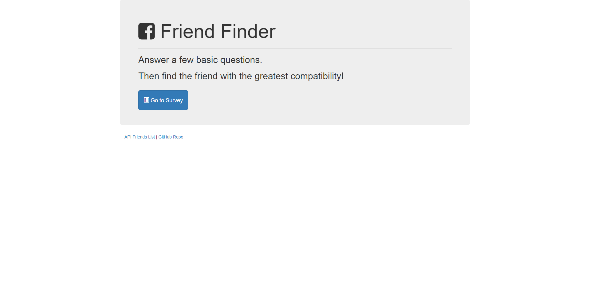
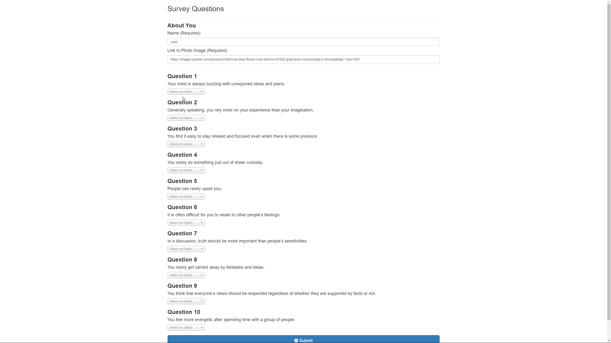
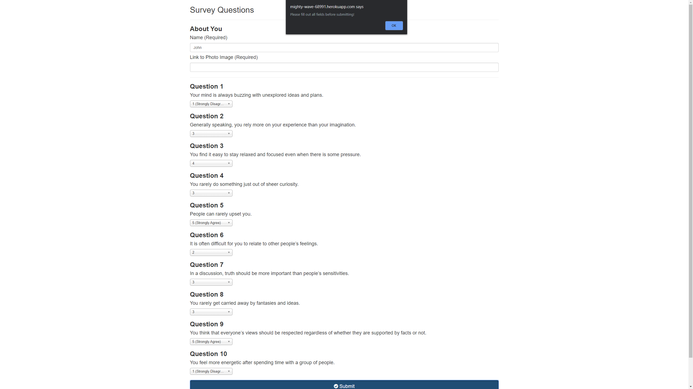
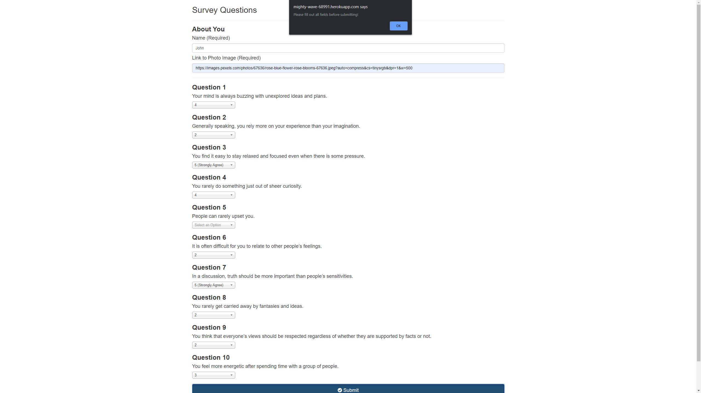

# Friend-Finder

Do you need a friend? If you do, you should try out this friend finder! This app asks you 10 questions and takes your responses and compares them to existing users. Once you submit your responses, you will be added into the database as well. 

## Demo

You can find a live demo of my friend finder application [here](https://mighty-wave-68991.herokuapp.com).

## Functionality
Upon going to the site, you are presented with this landing page. Here you can click the big blue button to go to the survey, or the smaller bottons to see everyone inside of the database, or see the Github repo that holds the code of this page. Below we will see this in action!

### Demos

1. Landing Page

Here is a quick demo of the survey! You can see that our test subject, John, entered an image, his name, and filled out the form. 

2. Survey Demo

Once he finished up all the requirements, he hit the submit button and our app paired him up with Barry! After he hits submit a second time, the app matches him up with himself because the answers he submitted were closest, or an exact match, to his own.

3. Trying to submit with missed info

Trying to submit with a field left blank will give you an error and your form won't be submitted :(. It will be the same if you miss your name, or miss a question.

## Logic
 * After you submitted your survey, behind the scenes, the app will compare the difference between your scores against the scores of other users, question by question. It will then add up the differences to calculate the `total difference` which is used to pair you up with the closest match.

     * Example:
       * User 1: `[5, 1, 4, 4, 5, 1, 2, 5, 4, 1]`
       * User 2: `[3, 2, 6, 4, 5, 1, 2, 5, 4, 1]`
       * Total Difference: **2 + 1 + 2 =** **_5_**
    * Example:
       * User 1: `[5, 1, 4, 4, 5, 1, 2, 5, 4, 1]`
       * User 3: `[4, 2, 6, 4, 5, 1, 2, 5, 4, 1]`
       * Total Difference: **1 + 1 + 2 =** **_4_**

    * Because the difference between user 1 and user 3 is smaller than the difference between user 1 and user 2, the app will match you up with user 3. 